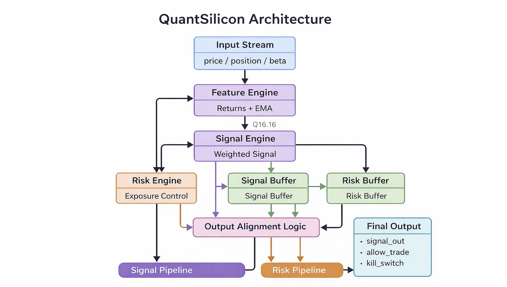

# QuantSilicon Architecture — Deep Dive 🧠

> **CogniChip Hackathon | LLM4ChipDesign Track**  
> A streaming, fixed-point hardware pipeline for real-time quantitative trading signals with deterministic risk enforcement.

---

## Table of Contents

1. [System Overview](#system-overview)
2. [Architecture Diagram](#architecture-diagram)
3. [Pipeline Philosophy](#pipeline-philosophy)
4. [Module-by-Module Breakdown](#module-by-module-breakdown)
   - [Input Stream](#1-input-stream)
   - [Feature Engine](#2-feature-engine)
   - [Signal Engine](#3-signal-engine)
   - [Risk Engine](#4-risk-engine)
   - [Signal Buffer & Risk Buffer](#5-signal-buffer--risk-buffer)
   - [Output Alignment Logic](#6-output-alignment-logic)
   - [Signal Pipeline & Risk Pipeline](#7-signal-pipeline--risk-pipeline)
   - [Final Output](#8-final-output)
5. [Data Flow & Timing](#data-flow--timing)
6. [Fixed-Point Arithmetic (Q16.16)](#fixed-point-arithmetic-q1616)
7. [Streaming Interface (AXI-Style Handshake)](#streaming-interface-axi-style-handshake)
8. [Risk Management Design](#risk-management-design)
9. [Design Decisions & Tradeoffs](#design-decisions--tradeoffs)
10. [Repository Structure](#repository-structure)
11. [Build & Simulation](#build--simulation)

---

## System Overview

QuantSilicon is a **fully pipelined, streaming RTL system** that computes quantitative trading signals and enforces risk controls — entirely in hardware, in real time.

The core idea: financial trading systems are latency-sensitive. Every microsecond of software overhead (OS scheduling, floating-point exceptions, memory indirection) introduces nondeterminism. QuantSilicon moves the hot path — signal computation and risk gating — into silicon logic that executes **deterministically, every clock cycle**.

### Key Properties

| Property | Value |
|---|---|
| Arithmetic | Signed Q16.16 fixed-point |
| Interface | AXI-style ready/valid streaming |
| Latency target | ≤ 5 cycles (steady state) |
| Throughput | 1 sample/cycle (pipelined) |
| Risk enforcement | Combinational kill-switch |
| HDL | SystemVerilog (IEEE 1800-2012) |

---

## Architecture Diagram


## Pipeline Philosophy

QuantSilicon is built around three principles:

**1. Separation of concerns between signal and risk.**  
Signal computation and risk evaluation run in **parallel branches**. Neither blocks the other. They are synchronized only at the final output alignment stage. This means risk overhead adds zero latency to the signal path.

**2. Backpressure safety at every stage.**  
Every module respects `ready`/`valid` handshaking. No data is silently dropped or corrupted under backpressure. Buffers absorb flow rate mismatches between parallel branches.

**3. Fixed-point determinism.**  
Floating-point hardware is expensive and non-deterministic across implementations. All math is Q16.16 fixed-point — same result, every cycle, every platform.

---

## Module-by-Module Breakdown

### 1. Input Stream

**File:** `quantsilicon_top.sv` (top-level port declarations)

The input stream carries three signals per sample, presented together on each valid clock cycle:

| Signal | Type | Description |
|---|---|---|
| `price` | Q16.16 signed | Current asset price |
| `position` | Q16.16 signed | Trader's current position size |
| `beta` | Q16.16 signed | Market-sensitivity / risk factor |

All three arrive together, gated by `in_valid` / `in_ready`. The top-level fans these out simultaneously to the **Feature Engine** and **Risk Engine**, enabling true parallel processing from cycle 0.

---

### 2. Feature Engine

**File:** `rtl/feature_engine.sv`

The Feature Engine is the **stateful core** of the pipeline. It maintains two running values across clock cycles and produces derived financial features.

#### What it computes

**Return (price delta):**
```
ret = price - prev_price
```
This is the simplest momentum signal — how much the price moved since the last sample. `prev_price` is a registered state variable updated every valid cycle.

**Exponential Moving Average (EMA):**
```
ema = ema + ((ret - ema) >> ALPHA_SHIFT)
```
This is an efficient, multiply-free EMA using a right-shift to approximate the smoothing coefficient:

```
alpha = 1 / 2^ALPHA_SHIFT = 1/32 ≈ 0.03125
```

The shift-based implementation eliminates a full multiplier on the critical path, reducing area and improving timing at the cost of alpha granularity (alpha must be a negative power of 2).

#### State registers

```systemverilog
logic signed [31:0] prev_price;   // previous price for return calc
logic signed [31:0] ema_state;    // running EMA accumulator
```

Both are initialized to zero and updated only when `in_valid && in_ready`.

#### Outputs to Signal Engine
- `ret_out` — Q16.16 return value
- `ema_out` — Q16.16 smoothed EMA value
- `feat_valid` — handshake valid

---

### 3. Signal Engine

**File:** `rtl/signal_engine.sv`

The Signal Engine takes the two features from the Feature Engine and produces a single **scalar trading signal** via a weighted linear combination.

#### Math

```
signal = (w1 * ret) + (w2 * ema)
```

Where the weights are fixed Q16.16 constants:

| Weight | Real Value | Q16.16 Hex | Q16.16 Decimal |
|---|---|---|---|
| `w1` | 0.75 | `0x0000C000` | 49152 |
| `w2` | 0.25 | `0x00004000` | 16384 |

#### Fixed-point multiplication detail

In Q16.16, multiplying two Q16.16 numbers yields a Q32.32 intermediate result. The Signal Engine right-shifts by 16 to recover Q16.16:

```systemverilog
wire signed [63:0] term1 = (ret_in * W1) >>> 16;
wire signed [63:0] term2 = (ema_in * W2) >>> 16;
assign signal_out = term1[31:0] + term2[31:0];
```

#### Fan-out

The Signal Engine is the **fork point** in the architecture. Its output feeds two downstream paths simultaneously:
- **Signal Buffer** → Output Alignment → Signal Pipeline → Final Output
- The `signal_out` value is also forwarded to the Risk Buffer for downstream alignment

---

### 4. Risk Engine

**File:** `rtl/risk_engine.sv`

The Risk Engine runs **in parallel** with the Feature + Signal path. It receives `position` and `beta` directly from the Input Stream and independently evaluates whether the current exposure is within acceptable limits.

#### Exposure Calculation

```
expo = abs(position) * beta
```

This computes the risk-adjusted exposure — how much market risk the current position represents, scaled by the asset's sensitivity factor (beta).

In Q16.16:
```systemverilog
wire signed [31:0] abs_pos = position[31] ? -position : position;
wire signed [63:0] expo_full = (abs_pos * beta) >>> 16;
wire signed [31:0] expo = expo_full[31:0];
```

#### Kill-Switch Logic

```
if (expo > LIMIT):
    kill_switch = 1
    allow_trade  = 0
```

`LIMIT = 2.0` in real terms → `131072` in Q16.16 (`2.0 * 65536`).

The kill-switch is **combinational** — it asserts in the same cycle the exposure is computed, with no additional pipeline register. This is intentional: risk should never be delayed by a register stage.

#### Outputs
- `kill_switch` — 1 if exposure exceeds limit
- `allow_trade` — inverse of kill_switch
- `risk_valid` — handshake valid

---

### 5. Signal Buffer & Risk Buffer

**File:** `rtl/quantsilicon_top.sv` (instantiated inline or as sub-modules)

The parallel branches — Signal Engine and Risk Engine — may not produce outputs at exactly the same cycle due to differing pipeline depths. The **Signal Buffer** and **Risk Buffer** are FIFO-style registers that absorb this timing skew.

#### Why both buffers are needed

```
Input ──► Feature Engine (1 cycle) ──► Signal Engine (1 cycle) ──► Signal Buffer
      └──► Risk Engine (1 cycle) ──────────────────────────────► Risk Buffer
```

Even with equal pipeline depths, backpressure from downstream can cause one branch to stall while the other continues. Buffers prevent data loss and maintain stream ordering.

#### Buffer Implementation

Each buffer is a simple register with a `valid` flag:

```systemverilog
always_ff @(posedge clk) begin
    if (upstream_valid && !buf_full) begin
        buf_data  <= upstream_data;
        buf_valid <= 1'b1;
    end else if (downstream_ready) begin
        buf_valid <= 1'b0;
    end
end
```

---

### 6. Output Alignment Logic

**File:** `rtl/quantsilicon_top.sv`

This is the **synchronization point** of the entire pipeline. The Output Alignment Logic waits until:
- `signal_buf_valid == 1` (a signal value is ready)
- `risk_buf_valid == 1` (a risk decision is ready)

Only when **both** are valid does it fire the output handshake. This guarantees that `signal_out`, `allow_trade`, and `kill_switch` always correspond to the **same input sample**.

```systemverilog
assign out_valid = signal_buf_valid && risk_buf_valid;

always_ff @(posedge clk) begin
    if (out_valid && out_ready) begin
        signal_out  <= signal_buf_data;
        allow_trade <= risk_buf_allow;
        kill_switch <= risk_buf_kill;
    end
end
```

This is the only place in the design where the two parallel branches merge. All upstream logic is fully decoupled.

---

### 7. Signal Pipeline & Risk Pipeline

These are the **downstream consumers** of the aligned output — shown in the architecture as the two terminal pipeline stages before Final Output.

In the current V1 implementation these represent the output registers / downstream system interfaces. In future versions, these could become:
- **Signal Pipeline:** order generation logic, position sizing, execution interface
- **Risk Pipeline:** portfolio-level aggregation, compliance logging, circuit breaker feedback

---

### 8. Final Output

The three output signals emitted after alignment:

| Signal | Width | Description |
|---|---|---|
| `signal_out` | 32-bit Q16.16 | Trading signal (positive = buy, negative = sell) |
| `allow_trade` | 1-bit | 1 if trade is permitted by risk engine |
| `kill_switch` | 1-bit | 1 if exposure limit has been breached |

A downstream execution system would consume these on every valid clock cycle where `out_valid && out_ready`.

---

## Data Flow & Timing

### Cycle-by-Cycle Pipeline Trace

```
Cycle 0:  Input arrives (price, position, beta) — in_valid=1
Cycle 1:  Feature Engine computes ret, ema
          Risk Engine computes expo, kill_switch (parallel)
Cycle 2:  Signal Engine computes weighted signal
          Risk result enters Risk Buffer
Cycle 3:  Signal result enters Signal Buffer
Cycle 4:  Output Alignment fires — both buffers valid
          signal_out, allow_trade, kill_switch presented
```

**Steady-state latency: 4 cycles**  
**Throughput: 1 sample/cycle** (pipeline is full after initial fill)

### Backpressure Scenario

If the downstream consumer stalls (`out_ready=0`):
- Output Alignment holds its output valid
- Signal Buffer and Risk Buffer assert backpressure upstream
- Feature Engine and Risk Engine stall gracefully
- No data is lost or corrupted

---

## Fixed-Point Arithmetic (Q16.16)

All numerical computation in QuantSilicon uses **signed Q16.16 fixed-point**:

```
Representation: [sign][15-bit integer].[16-bit fraction]
Total width:    32 bits
Range:          -32768.0 to +32767.99998
Precision:      1/65536 ≈ 0.0000153
```

### Encoding / Decoding

```python
# Encode
x_fixed = int(round(x_real * 65536))

# Decode
x_real = x_fixed / 65536
```

### Key Constants

| Constant | Real | Q16.16 |
|---|---|---|
| alpha (EMA) | 0.03125 | shift-5 (no multiply) |
| w1 (signal weight) | 0.75 | 49152 |
| w2 (signal weight) | 0.25 | 16384 |
| LIMIT (risk) | 2.0 | 131072 |

### Multiplication Overflow Protection

All intermediate products use 64-bit wires to prevent overflow before the final 16-bit right shift back to Q16.16. Only the lower 32 bits of the shifted result are used as the final Q16.16 output.

---

## Streaming Interface (AXI-Style Handshake)

Every module boundary in QuantSilicon uses a **ready/valid handshake**, consistent with AXI4-Stream conventions:

```
A transfer occurs if and only if: valid == 1 AND ready == 1
```

### Rules

1. **Producer** asserts `valid` when data is available and holds it until `ready` is seen
2. **Consumer** asserts `ready` when it can accept data
3. Neither side may depend on the other's signal to set its own (no combinational loops)
4. Data must be held stable while `valid` is high and `ready` is low

### Interface Diagram

```
Producer                    Consumer
   │                            │
   │──── valid ────────────────►│
   │◄─── ready ─────────────────│
   │──── data  ────────────────►│
   │                            │
   │  Transfer: valid & ready   │
```

---

## Risk Management Design

The risk engine is a first-class citizen in this architecture, not an afterthought.

### Design choices

**Why parallel, not sequential?**  
A sequential design would compute signal first, then check risk — adding latency to every sample. In parallel, risk adds zero latency to the signal path. The only cost is the alignment buffer.

**Why combinational kill-switch?**  
A registered kill-switch would delay enforcement by one cycle. In high-frequency contexts, one cycle of trade leakage is unacceptable. Combinational logic ensures the kill-switch is valid in the same cycle as the risk decision.

**Why absolute value on position?**  
Exposure is symmetric — a large short position is as risky as a large long. `abs(position)` correctly captures this.

**Why beta-weighted?**  
Raw position size ignores how sensitive the asset is to market moves. A 1-unit position in a high-beta asset carries more risk than the same position in a low-beta asset. Multiplying by beta gives a normalized risk-adjusted exposure comparable across assets.

---

## Design Decisions & Tradeoffs

| Decision | Chosen | Alternative | Reason |
|---|---|---|---|
| Arithmetic | Q16.16 fixed-point | IEEE 754 float | Determinism, area, timing |
| EMA alpha | Power-of-2 (shift) | Arbitrary multiply | Eliminates multiplier on feature path |
| Risk path | Parallel to signal | Sequential after signal | Zero risk latency overhead |
| Kill-switch | Combinational | Registered | Immediate enforcement |
| Buffering | Explicit FIFO registers | Implicit (rely on backpressure) | Prevents branch starvation |
| Interface | AXI-style ready/valid | Pulse-based | Composable, industry-standard |

---

## Repository Structure

```
QuantSilicon/
│
├── README.md                        # Project overview
├── Makefile                         # Build automation
│
├── docs/
│   ├── design_spec.md               # Formal design specification
│   ├── architecture_diagram.png     # Visual pipeline diagram
│   └── ai_optimization_log.md       # CogniChip AI interaction log
│
├── rtl/
│   ├── fxp_pkg.sv                   # Fixed-point type definitions & macros
│   ├── feature_engine.sv            # Return + EMA computation (stateful)
│   ├── signal_engine.sv             # Weighted signal generation
│   ├── risk_engine.sv               # Exposure calc + kill-switch logic
│   └── quantsilicon_top.sv          # Top-level integration & alignment
│
├── tb/
│   └── top_tb.sv                    # System-level testbench w/ backpressure
│
└── python_model/
    ├── golden_model.py              # Bit-accurate Python reference model
    └── generate_test_data.py        # Test vector generation script
```

---

## Build & Simulation

### Prerequisites
- `iverilog` ≥ 11.0
- `vvp` (bundled with iverilog)
- `gtkwave` (optional, for waveform viewing)

### Compile

```bash
iverilog -g2012 -o sim_top.out \
  rtl/fxp_pkg.sv \
  rtl/feature_engine.sv \
  rtl/signal_engine.sv \
  rtl/risk_engine.sv \
  rtl/quantsilicon_top.sv \
  tb/top_tb.sv
```

### Run Simulation

```bash
vvp sim_top.out
```

### View Waveforms

```bash
gtkwave top.vcd
```

### Generate Test Vectors

```bash
cd python_model
python generate_test_data.py > ../tb/test_vectors.hex
```

### Verify Against Golden Model

```bash
python python_model/golden_model.py
# Compare stdout against simulation log
```

---

## Team

| Member | Role |
|---|---|
| **Chintan** | Chief Architect & Quant Engineer — system architecture, quant model, fixed-point spec, pipeline integration |
| **Faiza** | Verification & Testing — testbench development, simulation validation, backpressure testing, output correctness |
| **Akhash** | RTL Development & Optimization — module implementation, timing-aware RTL, interface integration, synthesis prep |

---

## Future Directions

- **Adaptive volatility weighting** — dynamically adjust `w1`/`w2` based on realized vol
- **Multi-asset lanes** — parallel pipelines for portfolio-level signal generation
- **Hardware risk aggregation** — cross-asset exposure summation in silicon
- **FPGA deployment** — targeting Xilinx Ultrascale+ with Vivado synthesis
- **AI-guided architecture search** — using CogniChip to explore latency/area Pareto front

---

*Built for the CogniChip Hackathon — LLM4ChipDesign Track*